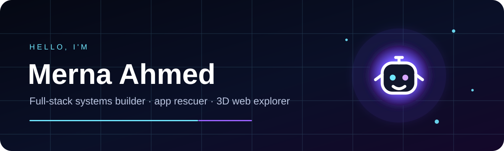
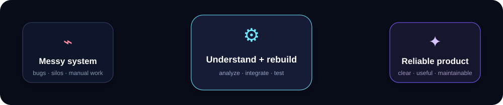

### I turn complicated systems into products people can actually use.

`Internal tools` · `Application rescue` · `API integrations` · `3D web` · `Legacy modernization`

---

## 🪄 What I build

I build internal tools, workflow automations, integrations, and modernization solutions for businesses dealing with scattered data, manual processes, or difficult existing applications.

My background includes enterprise development at IBM and hands-on work across React, Next.js, Python, FastAPI, PHP, MySQL, REST APIs, authentication, documentation, and legacy-system analysis.

| 🧭 Understand | 🛠️ Modernize | ✨ Deliver |
|---|---|---|
| Map unfamiliar codebases, dependencies, workflows, and operational risks. | Repair apps, connect APIs, replace manual steps, and improve maintainability. | Build polished interfaces, documented systems, tests, and deployment-ready solutions. |

## 🚀 Featured builds

| | |
|---|---|
| **🌌 [Immersive Full-Stack Lab](https://merna-immersive-fullstack-lab.netlify.app)** Seven interactive 3D product concepts.  `React` `Three.js` `Netlify Functions` [Source →](https://github.com/Mirnamo/immersive-fullstack-lab) | **🧯 [AI App Rescue Lab](https://github.com/Mirnamo/ai-app-rescue-lab)** Before-and-after application rescue case study.  `FastAPI` `Python` `Docker` `Pytest` |
| **🧬 [Legacy Code Intelligence](https://github.com/Mirnamo/legacy-code-intelligence)** Code inventory, dependency mapping, and explainable health scoring.  `React` `FastAPI` `Static analysis` | **🗂️ [Operations Workflow Hub](https://github.com/Mirnamo/operations-workflow-hub)** Role-aware queues, reporting, and audit history.  `React` `REST APIs` `Docker` |
| **💳 [FinFlow Banking Dashboard](https://github.com/Mirnamo/Banking_app)** Secure sandbox banking integrations and operational workflows.  `Next.js` `Appwrite` `Plaid` `Dwolla` | **🎓 Enterprise perspective** IBM Z, z/OS, REXX, HLASM, architecture, and legacy-code analysis.  `Systems` `Modernization` `Documentation` |

## 🧰 My toolbox

## 🎮 Currently exploring

- Durable backends for immersive 3D product experiences
- Safer ways to rescue and modernize AI-generated applications
- Codebase intelligence for legacy and enterprise systems
- Clear interfaces for complex operational workflows

---

### Have a messy application or workflow?

**I can understand it, make it reliable, and explain what changed.**

[Portfolio](https://mernaahmedportfolio.netlify.app/) · [Projects](https://github.com/Mirnamo?tab=repositories) · [LinkedIn](https://www.linkedin.com/in/mirna-ahmed-253677257/)

Built with curiosity, careful engineering, and probably too many browser tabs ✦

